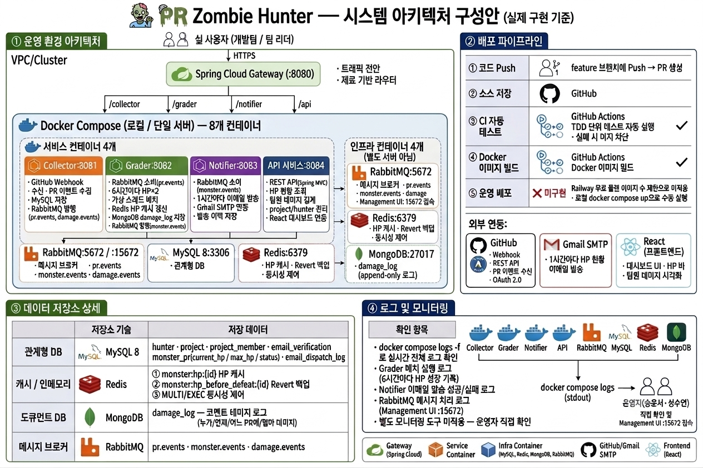

# 🧟 PR Zombie Hunter
팀 프로젝트 · 8인 · 2026년 5월~6월
v2 — HP 몬스터 시스템 + RabbitMQ 도입


> 
  **⚡ 컨셉 변경 요약 (v1 → v2)**
> 
  기존 **3·7·14일 등급제**를 **HP 몬스터 시스템**으로 전환하고, 서비스 간 통신을 REST 직접 호출에서 **RabbitMQ 메시지 큐**로 교체합니다.


## 1. 프로젝트 개요
PR Zombie Hunter는 GitHub에서 PR에 코멘트를 달거나 병합하는 과정에 게임 요소를 더한 협업 도구다. 방치된 PR은 시간이 지날수록 HP가 폭발적으로 커지는 몬스터가 되고, 팀원들은 코멘트로 데미지를 넣어 함께 처치한다. PR 관리를 의무가 아닌 팀 플레이로 만드는 것이 목적이다.


## 2. HP 몬스터 시스템 상세


### 2-1. 몬스터 HP 성장 규칙
PR이 방치되면 몬스터가 생성된다. 초기 HP는 **10,000**이며, 이후 **6시간마다 현재 HP × 2**로 자동 성장한다.

| 경과 시간 | HP | 비고 |
| --- | --- | --- |
| 0시간 | 10,000 | 몬스터 생성 |
| +6시간 | 20,000 | 1회 성장 |
| +12시간 | 40,000 | 2회 성장 |
| +18시간 | 80,000 | 3회 성장 |
| +24시간 | 160,000 | 4회 성장 |
| +30시간 | 320,000 | 5회 성장 🚨 |


### 2-2. 데미지 규칙
팀원이 해당 PR에 GitHub 코멘트를 달면 몬스터에게 **5,000 데미지**가 적용된다. 같은 PR에 같은 사람이 여러 번 코멘트를 달아도 데미지는 **1회만 인정**된다.

| 상황 | 이전 HP | 이후 HP | 비고 |
| --- | --- | --- | --- |
| 몬스터 생성 | — | 10,000 | PR 방치 시작 |
| 코멘트 1명 | 10,000 | 5,000 | 5,000 데미지 적용 |
| 6시간 경과 | 5,000 | 15,000 | 성장 (×2) 후 기존 데미지 유지 |
| 코멘트 2번째 | 15,000 | 10,000 | 두 번째 팀원 데미지 |
| PR 머지 | any | 처치 완료 | 즉시 처치 |
| Revert | 0 | 복원 | Redis `hp_before_defeat` 값으로 부활 |


### 2-3. 처치 완료 조건

| 조건 | 처리 방식 |
| --- | --- |
| HP ≤ 0 | 처치 완료 (팀원 협력 처치) |
| PR Merge | 즉시 처치 완료 |
| PR Close | 즉시 처치 완료 |
| PR Revert | 몬스터 부활 — Redis `hp_before_defeat` 값 복원 |


### 2-4. 알림 주기
1시간마다 프로젝트 참여자 전원에게 이메일 발송. 이메일 내용: 현재 생존 중인 몬스터 목록, 각 HP, 처치까지 필요한 코멘트 수.


## 3. 시스템 아키텍처 (RabbitMQ 도입)


### 3-1. RabbitMQ란?
RabbitMQ는 서비스와 서비스 사이에서 메시지를 주고받는 것을 중계해주는 **메시지 브로커**다. 서비스 A가 서비스 B를 직접 호출하는 대신, 메시지를 큐에 넣어두면 서비스 B가 자신의 속도에 맞춰 꺼내서 처리하는 구조다. AMQP 프로토콜 기반이며, Exchange(라우터) → Queue(우편함) → Consumer(처리자) 구조로 동작한다.


### 이 프로젝트에서 RabbitMQ를 쓰는 이유

  - Grader(6시간 배치)와 Notifier(1시간 배치)의 실행 주기가 달라 REST 동기 호출로는 타이밍을 맞추기 어렵다.
  - 한 서비스가 잠깐 다운되어도 메시지가 큐에 남아 있어 유실이 없다 (durable queue).
  - 나중에 Slack 알림, 슬래시 커맨드 같은 subscriber를 추가할 때 Exchange에 바인딩만 하면 된다.


### 3-2. 전체 아키텍처 다이어그램




## 4. DB 스키마


### 4-1. ERD 구조


**project (프로젝트)**

| 컬럼 | 타입 | 키 |
| --- | --- | --- |
| id | BIGINT AUTO_INCREMENT | PK |
| name | VARCHAR(100) | |
| repository_url | VARCHAR(255) | |
| created_at | TIMESTAMP | |

**hunter (헌터)**

| 컬럼 | 타입 | 키 |
| --- | --- | --- |
| id | VARCHAR(100) | PK |
| name | VARCHAR(50) | |
| email | VARCHAR(150) | |
| github_username | VARCHAR(100) | |
| created_at | TIMESTAMP | |

**project_member (프로젝트 멤버)**

| 컬럼 | 타입 | 키 |
| --- | --- | --- |
| hunter_id | VARCHAR(100) | FK |
| project_id | BIGINT AUTO_INCREMENT | FK |

**email_verification (이메일 인증)**

| 컬럼 | 타입 | 키 |
| --- | --- | --- |
| id | BIGINT AUTO_INCREMENT | PK |
| email | VARCHAR(150) | |
| verification_code | VARCHAR(10) | |
| expires_at | TIMESTAMP | |
| is_verified | BOOLEAN | |

**monster_pr (몬스터)**

| 컬럼 | 타입 | 키 | 설명 |
| --- | --- | --- | --- |
| id | VARCHAR(50) | PK | GitHub PR 고유 ID |
| id2 | BIGINT AUTO_INCREMENT | FK | 프로젝트 식별자 |
| title | VARCHAR(255) | | |
| author | VARCHAR(100) | | |
| current_hp | INT | | 실시간 남은 HP |
| max_hp | INT | | 시간 경과에 따라 늘어나는 Max HP |
| status | VARCHAR(20) | | ALIVE(전투중), SLAIN(처치완료) |
| updated_at | TIMESTAMP | | 1시간 간격 체력 증가 및 메일 발송 체크용 |

**email_dispatch_log (이메일 발송 이력)**

| 컬럼 | 타입 | 키 |
| --- | --- | --- |
| id | BIGINT AUTO_INCREMENT | PK |
| hunter_id | VARCHAR(100) | FK |
| monster_pr_id | VARCHAR(50) | FK |
| project_id | BIGINT AUTO_INCREMENT | FK |
| subject | VARCHAR(255) | |
| status | VARCHAR(20) | PENDING, SUCCESS, FAILED |
| sent_at | TIMESTAMP | |


※ `damage_log`는 대량 로그 데이터 특성에 맞춰 **MongoDB**에 별도 저장 (아래 섹션 참고)


## 5. 사용자 흐름 (User Flow)

```
[개발자]
    │ PR 생성 / 코멘트 작성
    ▼
[GitHub]
    │ Webhook 이벤트 발송
    ▼
[Collector :8081]
    │ PR 수집 → MySQL 저장
    │ MQ 발행 → pr.events (pr.created / damage.applied)
    ▼
[RabbitMQ]
    │ 라우팅
    ├── pr.events → [Grader :8082]
    │       │ 6시간마다 HP × 2 (가상 스레드)
    │       │ HP 연산 → Redis 캐시 갱신
    │       │ 데미지 로그 → MongoDB 저장
    │       │ MQ 발행 → monster.events (hp_updated / defeated)
    │       │ Redis: hp_before_defeat 저장
    │       ▼
    └── monster.events → [Notifier :8083]
            │ 1시간마다 전체 이메일 발송
            ▼
          [팀원 수신 — HP 현황 이메일]

[팀원]
    │ 대시보드 접속 → REST API 조회
    ▼
[프론트엔드 (React)] ← REST API :8084 (API Gateway 경유)
    │ HP 바 + 팀원별 데미지 기여 확인
    │ PR 머지 → 처치 완료
```


## 6. 기술 스택


**백엔드**

| 분류 | 기술 | 용도 |
| --- | --- | --- |
| 언어 / 프레임워크 | Java 21 · Spring Boot | MSA 3개 서비스(Collector, Grader, Notifier) 구현 |
| API | REST API (Spring MVC) | 대시보드 데이터 조회 — HP 현황, 팀원 데미지 집계 |
| API Gateway | Spring Cloud Gateway | 경로 기반 라우팅, JWT 인증, Rate Limit |
| 동시성 | Java 21 Virtual Threads | 6시간 배치 시 전체 몬스터 HP 병렬 갱신 |

**메시지 / 이벤트**

| 분류 | 기술 | 용도 |
| --- | --- | --- |
| 메시지 브로커 | RabbitMQ | 서비스 간 비동기 통신 (pr.events · monster.events · damage.events) |

**데이터 저장소**

| 분류 | 기술 | 용도 |
| --- | --- | --- |
| 관계형 DB | MySQL 8 | project · hunter · monster_pr · email_dispatch_log 등 핵심 도메인 데이터 |
| 도큐먼트 DB | MongoDB | damage_log — 코멘트 데미지 로그 (대량 append-only 데이터) |
| 캐시 / 인메모리 | Redis | ① 현재 HP 캐시 (실시간 조회 최적화) · ② hp_before_defeat 키 (Revert 부활용) · ③ HP 차감 동시성 제어 (MULTI/EXEC) |
| DB 마이그레이션 | Flyway | SQL 마이그레이션 버전 관리 |

**외부 연동**

| 분류 | 기술 | 용도 |
| --- | --- | --- |
| PR 수집 | GitHub Webhook · GitHub REST API | PR 생성/클로즈/Revert 이벤트 수신, 코멘트 이벤트 수신 |
| 인증 | GitHub OAuth 2.0 | 팀원 GitHub 계정 연동 |
| 이메일 | Gmail SMTP (JavaMail) | 1시간마다 HP 현황 이메일 발송 |

**인프라 / DevOps**

| 분류 | 기술 | 용도 |
| --- | --- | --- |
| 컨테이너 | Docker · Docker Compose | Collector / Grader / Notifier / API / RabbitMQ / Redis / MySQL / MongoDB 8개 컨테이너 |
| CI | GitHub Actions | PR 올리면 자동 TDD 테스트 실행 → 실패 시 머지 차단 |
| CD | GitHub Actions + Railway | main 브랜치 머지 → Docker 이미지 빌드 → 자동 배포 (※ 아래 비고 참고) |
| 이슈 관리 | Jira (칸반) | Epic > Story > Task > Spike 계층 구조, PR 커밋 메시지 자동 연동 |

**프론트엔드**

| 분류 | 기술 | 용도 |
| --- | --- | --- |
| 프레임워크 | React | 대시보드 UI — HP 바, 팀원 데미지 기여 시각화 |
| API 통신 | REST API | API Gateway 경유 HP 현황 / 팀원 데미지 조회 |


> ⚠️ ※ **Railway CD 비고**: Railway 무료 플랜은 배포 가능한 Docker 이미지 수에 제한이 있어, 이 프로젝트에서는 실제 배포에 활용하지 못했다. 일정 계획에는 포함되어 있으나 미적용 상태로 남아있다.


### 주요 기술 선택 이유


### REST API — GraphQL 미사용 이유
GraphQL은 클라이언트가 필요한 필드만 골라 요청할 수 있어, 여러 화면이 서로 다른 데이터 조합을 요구할 때 오버패치(필요 이상 응답)나 언더패치(데이터 부족으로 추가 요청 필요) 문제를 줄여준다. 다만 이 프로젝트는 각 엔드포인트가 반환하는 데이터 구조가 명확하게 고정되어 있어, 화면마다 요청 필드가 달라질 여지가 적다. REST API로도 충분히 깔끔하게 설계할 수 있고, 팀의 학습 비용과 구현 복잡도를 줄이는 쪽이 더 실용적이라 판단했다.


### MongoDB — damage_log 저장소
코멘트가 달릴 때마다 누가, 언제, 어느 PR에, 얼마의 데미지를 줬는지 기록이 쌓인다. 삭제도 수정도 없이 계속 추가되는 로그성 데이터다. 팀원 8명이 여러 PR에 계속 코멘트를 달면 양이 방대해지는데, MySQL은 이런 대량 로그를 저장하기엔 스키마가 딱딱하고 쓰기 성능이 상대적으로 느리다. MongoDB는 스키마가 유연하고 로그처럼 계속 추가되는 데이터에 최적화되어 있어서 damage_log에 사용한다.


### Redis — 두 가지 역할
**① HP 빠른 처리 (캐시)**

HP는 6시간마다 2배로 커지고, 코멘트가 달릴 때마다 깎이고, 대시보드에서 팀원들이 실시간으로 조회한다. 매번 MySQL까지 갔다 오면 속도가 느리다. Redis는 메모리 기반이라 MySQL보다 100배 이상 빠르게 읽고 쓸 수 있어서, 현재 HP를 Redis에 올려두고 거기서 바로 처리한다.

**② 트랜잭션 오류 방지 (동시성 제어)**

팀원 여러 명이 같은 PR에 동시에 코멘트를 달면, HP를 동시에 깎으려는 요청이 한꺼번에 들어온다. MySQL에서 이걸 처리하면 "둘 다 20,000을 읽고 둘 다 15,000으로 저장"하는 충돌이 생길 수 있다. Redis의 MULTI/EXEC 트랜잭션을 쓰면 HP 차감을 순서대로 원자적으로 처리해서 이 문제를 막는다.


## 7. TDD

### 7-1. 백엔드 A (Collector) — 조혜연

**Collector — 중복 PR 스킵 테스트 (SCRUM-50)**
- Given: 동일한 PR(`pr_number=42`)이 DB에 이미 저장되어 있는 상태
- When: 같은 `pr_number=42`를 가진 Webhook 이벤트를 다시 수신
- Then: DB의 PR 레코드 수에 변화 없음 + 중복 스킵 로그 출력

**Collector — GitHub API 정상 응답 시 PR 수집**
- Given: GitHub API가 PR 목록(`title`, `number`, `updated_at`, `state`, `html_url`)을 정상적으로 반환하는 상태
- When: Collector가 해당 레포지토리의 PR 목록 수집 요청
- Then: 응답받은 PR이 누락 없이 MySQL DB에 저장됨 + 저장된 PR의 `last_activity_at`이 `updated_at`과 일치

**Collector — GitHub API 500 오류 처리**
- Given: GitHub API 서버가 500 Internal Server Error를 반환하는 상태
- When: Collector가 PR 목록 수집 요청
- Then: Collector 서버가 종료되지 않고 에러 로그 출력 + DB에 아무것도 저장되지 않음 + 사용자에게 500 응답 반환

**Collector — GitHub API Rate Limit 초과 처리**
- Given: GitHub API 응답 헤더의 `X-RateLimit-Remaining` 값이 0인 상태 (시간당 호출 한도 초과)
- When: Collector가 PR 목록 수집 요청
- Then: API 호출을 중단하고 Rate Limit 경고 로그 출력 + DB에 아무것도 저장되지 않음 + 일정 시간 후 재시도

**Collector — closed 상태 PR 저장**
- Given: `pr_number=77`인 PR이 DB에 OPEN 상태로 저장되어 있는 상태
- When: 같은 `pr_number=77`의 `action=closed` Webhook 이벤트 수신
- Then: DB의 해당 PR 상태가 KILLED(처치완료)로 업데이트 + 새 레코드 생성 없음


### 7-2. 백엔드 B (Grader) — 김관혁

테스트 사양서를 문서화하여 전체 생애주기 검증 완료 (위치: `com/zombie/grader/service/`)

- **TEST_SMALL.md**: HP 성장 알고리즘 및 Redis 캐싱 로직 검증
- **TEST_MEDIUM.md**: 코멘트 데미지 차감 및 중복 작성 방어 로직 검증
- **TEST_LARGE.md**: PR 생애주기(생성 / 처치 / 복원) 데이터 정합성 검증


### 7-3. 백엔드 C (Notifier / API) — 성수연

**graphql-service — PullRequestQueryTest**
- 전체 조회 시 모든 PR 반환
- BOSS 등급 필터링 시 해당 PR만 반환
- 해당 등급 PR 없으면 빈 리스트 반환
- 존재하지 않는 PR id 조회 시 `null` 반환
- 존재하는 PR id 조회 시 해당 PR 반환

**graphql-service — HunterMutationTest**
- 처치완료 시 PR 상태 KILLED 변경 + `hunter_action` 저장 확인
- 존재하지 않는 PR이어도 `hunter_action`은 저장됨

**notifier — MailServiceTest**
- ZOMBIE 등급 PR 이메일 발송 확인
- BOSS 등급 PR 이메일 발송 확인
- 이미 발송한 PR은 중복 발송하지 않음
- 미발송 PR은 정상 발송됨

**api-service — PullRequestControllerTest (Small)**

Repository를 MockK로 Mock 처리해 DB 연결 없이 컨트롤러 로직만 검증한다.

- 전체 조회: 등급 필터 없이 요청 시 전체 PR이 200으로 반환되는지 검증
- 등급 필터 조회: BOSS 등급으로 필터링 시 해당 PR만 반환되는지 검증
- 단건 조회: 존재하는 ID는 200, 존재하지 않는 ID는 404 반환 검증

외부 의존성 없이 컨트롤러 비즈니스 로직만 순수하게 검증하여 테스트 실행 속도가 빠르다.

**notifier — 전면 재작성 (Small/Medium 분류 기준 적용)**
- `MailServiceTest` (Small): JavaMailSender Mock, 발송 메커니즘 검증
- `ZombieMailTemplateTest` (Small): 이벤트별 제목/본문 순수 함수 검증
- `ZombieNotifierServiceTest` (Small): 발송 조건 분기, 중복 방지 로직 검증
- `HourlyNotifierSchedulerTest` (Small): 스케줄러 발송 조건 검증
- `NotificationRepositoryTest` (Medium): H2 인메모리 DB로 실제 쿼리 검증


## 8. 팀 이슈 / 트러블슈팅

프로젝트 진행 중 팀 전체에 영향을 미쳤던 주요 기술 변경 및 의사결정을 기록한다.

---

### ① Railway 무료 플랜 — Docker 이미지 등록 수 제한

**배경**: CD 파이프라인으로 Railway를 채택하여 GitHub Actions에서 Docker 이미지를 빌드 후 자동 배포하는 구조를 설계했다.

**문제**: Railway 무료 플랜은 배포 가능한 Docker 이미지(서비스) 수에 제한이 있어, Collector / Grader / Notifier / API Gateway / RabbitMQ / Redis / MySQL / MongoDB 8개 컨테이너를 모두 배포하는 것이 불가능했다.

**결과**: CD 단계를 미적용 상태로 남기고 CI(빌드/테스트 자동화)만 운영하는 것으로 결정. `ci.yml`에서 `deploy` / `approve` 잡을 제거하고 CI만 유지.

---

### ② Spring GraphQL → graphql-kotlin → REST API 전환

**배경**: 초기 설계에서 API 레이어를 GraphQL로 구성하여 등급별 필터, 헌터 현황 등 다양한 조합의 쿼리를 단일 엔드포인트로 처리하는 구조를 목표로 했다.

**1차 전환 — Spring GraphQL → graphql-kotlin**: Spring GraphQL과 Spring Boot 4.x 간 의존성 충돌이 발생하여 Kotlin 친화적인 `graphql-kotlin` 라이브러리로 전환을 시도했다.

**2차 전환 — graphql-kotlin → REST API**: `graphql-kotlin`도 팀 내 학습 비용이 높고, 이 프로젝트에서 각 엔드포인트가 반환하는 데이터 구조가 명확히 고정되어 있어 GraphQL의 장점이 크지 않다고 판단. React 대시보드 연동 및 유지보수 편의를 위해 Spring MVC REST API로 최종 전환했다.

**영향 범위**: BC(성수연) api-service 전면 리팩토링, 기존 GraphQL Resolver → REST Controller 교체.

---

### ③ 전반적인 기획 변경 — v1 등급제 → v2 HP 몬스터 시스템

**배경**: 초기 기획(v1)은 방치 기간 기반 3·7·14일 등급제(새싹좀비 / 좀비 / 보스좀비)로, 등급 변경 시 1회 알림을 보내는 단순한 구조였다.

**변경 내용**:

| 항목 | v1 (등급제) | v2 (HP 몬스터) |
| --- | --- | --- |
| 트리거 주기 | 3일 / 7일 / 14일 방치 시 | 6시간마다 HP × 2 성장 |
| 상태 표현 | 등급 (새싹좀비 / 좀비 / 보스좀비) | HP 수치 |
| 팀원 상호작용 | 없음 | 코멘트 → 5,000 데미지 |
| 처치 조건 | PR 머지 / 클로즈 | HP ≤ 0 또는 PR 머지 / 클로즈 |
| 알림 주기 | 등급 변경 시 1회 | 1시간마다 정기 이메일 |

**영향 범위**: Grader 배치 주기 변경(자정 1회 → 6시간마다), Notifier 알림 로직 전면 재작성, DB 스키마 변경(zombie_grade → current_hp / max_hp), 프론트엔드 UI 전면 재설계(등급 뱃지 → HP 바).

---

### ④ GraphQL → REST API 전환 (API 레이어)

③번 기획 변경 및 ②번 기술 검토 결과와 맞물려, 팀 전체 API 레이어를 REST API로 통일하기로 결정. 상세 내용은 ② 항목 참고. BC(성수연) 개인 트러블슈팅 ① 항목과 연동.

---

### ⑤ WebSocket → RabbitMQ (서비스 간 통신)

**배경**: 초기 설계에서 Grader → Notifier 간 실시간 이벤트 전달을 WebSocket으로 구현하는 방안을 검토했다.

**문제**: WebSocket은 양방향 실시간 통신에 최적화되어 있으나, 이 프로젝트의 Grader(6시간 배치)와 Notifier(1시간 배치)는 실행 주기가 달라 동기 연결을 유지할 필요가 없었다. 또한 한 서비스가 일시적으로 다운될 경우 메시지 유실이 발생할 수 있다는 문제가 있었다.

**결정**: 비동기 메시지 큐 방식인 RabbitMQ로 전환. 서비스가 다운되어도 메시지가 큐에 남아 유실이 없고(durable queue), 각 서비스가 자신의 주기에 맞춰 독립적으로 메시지를 소비할 수 있다. BC(성수연) 개인 트러블슈팅 ② 항목과 연동.

---

### ⑥ DB 추가 — Redis · MongoDB 도입

**배경**: 초기 설계는 MySQL 단일 DB 구조였다.

**Redis 도입 이유**: HP는 6시간마다 2배 성장하고 코멘트마다 깎이며 대시보드에서 실시간 조회된다. MySQL 매 조회는 성능 부담이 크고, 팀원 여러 명이 동시에 코멘트를 달 경우 HP 차감 충돌(Race Condition)이 발생할 수 있다. Redis를 HP 캐시 및 MULTI/EXEC 동시성 제어에 활용하고, `hp_before_defeat` 키로 Revert 부활용 HP 백업도 담당하게 했다.

**MongoDB 도입 이유**: `damage_log`는 코멘트가 달릴 때마다 append-only로 쌓이는 대량 로그 데이터다. 삭제·수정이 없고 쓰기가 빈번하여 MySQL보다 MongoDB가 적합하다고 판단. 스키마 유연성도 로그 데이터 특성에 맞다.

**영향 범위**: Docker Compose에 Redis · MongoDB 컨테이너 추가(총 8개), BB(김관혁) Redis 동시성 로직 구현, BC(성수연) MongoDB damage_log 연동.

---

### ⑦ Kotlin(앱) → React(웹) — 프론트엔드 전환

**배경**: 초기 기획에서 프론트엔드를 Kotlin 기반 모바일/데스크톱 앱으로 설계했다.

**문제**: Kotlin 앱은 팀원 대부분이 익숙하지 않은 플랫폼이었고, GitHub PR 대시보드 특성상 브라우저에서 바로 접근하는 웹이 훨씬 자연스러운 사용 흐름이다. 또한 REST API로의 전환(④번)과 맞물려 React와의 연동이 더 단순했다.

**결정**: React 웹 대시보드로 전환. HP 바, 팀원별 데미지 기여 시각화 등 동적 UI를 React 컴포넌트로 구현.

**영향 범위**: FE(최소영) 개발 환경 전환, API 연동 방식 GraphQL → REST로 변경.

---

### ⑧ TDD 전면 수정

**배경**: 프로젝트 중반 기획 변경(③번)으로 등급제 기반으로 작성된 기존 테스트가 HP 몬스터 시스템과 맞지 않게 되었다. API 레이어 전환(②④번)으로 GraphQL Resolver 테스트도 무효화되었다.

**결정**: 기존 테스트 전량 삭제 후 Small / Medium / Large 크기 분류 기준에 맞게 전면 재작성.

- **Small**: 외부 의존성 없이 순수 로직만 검증 (Mock 사용)
- **Medium**: H2 인메모리 DB 등 경량 인프라와 함께 검증
- **Large**: 전체 서비스 흐름 E2E 검증

**영향 범위**: BA · BB · BC 전원 테스트 재작성. 각 담당자별 상세 내용은 7. TDD 섹션 참고.

---

### ⑨ 시스템 아키텍처 전면 수정

위 변경들이 누적되면서 초기 아키텍처 다이어그램이 실제 구현과 크게 달라졌다. 주요 변경점을 반영하여 아키텍처를 전면 재설계했다.

| 항목 | v1 아키텍처 | v2 아키텍처 |
| --- | --- | --- |
| 서비스 간 통신 | REST 직접 호출 | RabbitMQ 메시지 큐 |
| API 레이어 | GraphQL (:8084) | REST API (:8084) |
| DB 구성 | MySQL 단일 | MySQL + Redis + MongoDB |
| 프론트엔드 | Kotlin 앱 | React 웹 |
| 알림 트리거 | 등급 변경 시 1회 | 1시간 정기 스케줄러 |
| 컨테이너 수 | 4개 | 8개 |

---

## 9. 트러블슈팅 (개인별)

### 9-1. 팀장 / DevOps — 송윤서

**① [TRB-001] 루트 Gradle Wrapper 누락으로 인한 빌드 실패**

Spring Boot 4.0.6 실행 시 IntelliJ가 자체 Gradle 8.13을 사용하면서 빌드 실패. 루트 프로젝트에 Gradle Wrapper가 없어 IntelliJ가 자체 버전으로 폴백한 것이 원인이었다. 루트에 Gradle Wrapper를 추가하고 전 서비스를 Gradle 9.5.1 기반으로 통일하여 해결.

**② [TRB-002] 서비스 폴더 내 Dockerfile 누락으로 인한 빌드 실패**

`docker compose up` 실행 시 각 서비스의 Dockerfile을 찾지 못해 빌드 실패. MSA 서비스 폴더 초기 생성 시 Dockerfile이 포함되지 않은 것이 원인. 각 서비스 폴더에 Dockerfile을 생성 후 `docker compose up` 정상 실행 확인.

---

### 9-2. 백엔드 A (Collector) — 조혜연

**① spring-dotenv 라이브러리 Spring Boot 4.x 호환성 문제** `SCRUM-52`

`http://localhost:8081` 접속 시 GitHub OAuth 페이지 URL에 Client ID 대신 변수명 그대로(`$%7BGITHUB_CLIENT_ID%7D`) 표시됨. `build.gradle.kts`에 Spring Boot 2.x용 아티팩트(`me.paulschwarz:spring-dotenv:4.0.0`)를 사용한 것이 원인. Spring Boot 4.x에서는 별도 아티팩트가 필요하며, `me.paulschwarz:springboot4-dotenv:5.0.1`로 교체 후 정상 동작 확인.

```kotlin
// 변경 전
implementation("me.paulschwarz:spring-dotenv:4.0.0")

// 변경 후
implementation("me.paulschwarz:springboot4-dotenv:5.0.1")
```

**② jackson-module-kotlin 패키지 그룹 ID 오류** `SCRUM-60`

`WebhookController.kt`에서 `ObjectMapper`와 `registerKotlinModule()`을 import할 수 없어 `Unresolved reference` 컴파일 오류 발생. `tools.jackson.module`은 Spring Boot 4.x 내부용 패키지명으로, 외부에서 직접 사용할 때는 기존 패키지명인 `com.fasterxml.jackson.module`을 써야 한다.

```kotlin
// 변경 전
implementation("tools.jackson.module:jackson-module-kotlin")

// 변경 후
implementation("com.fasterxml.jackson.module:jackson-module-kotlin")
```

**③ SecurityConfig.kt 파일 위치 오류** `SCRUM-52`

`SecurityConfig.kt`를 생성했으나 Spring이 Bean으로 인식하지 못하는 문제 발생. IntelliJ에서 파일 생성 시 `collector/` 루트에 잘못 생성됨. Spring Boot는 `@SpringBootApplication` 선언 패키지 하위만 컴포넌트 스캔하므로, `src/main/kotlin/com/zombie/collector/` 하위로 이동 후 정상 등록 확인.

---

### 9-3. 백엔드 B (Grader) — 김관혁

**① Gradle 9.5.1 툴체인 호환성 오류**

Gradle 9.5.1 빌드 시 Java 툴체인 호환성 오류 발생. `settings.gradle.kts`에 Foojay 플러그인(1.0.0)을 적용하여 해결 및 빌드 안정성 확보.

```kotlin
// settings.gradle.kts
plugins {
    id("org.gradle.toolchains.foojay-resolver-convention") version "1.0.0"
}
```

Given-When-Then 패턴의 `GraderServiceTest` 작성 및 단위/E2E 테스트 100% 통과로 검증 완료.

---

### 9-4. 백엔드 C (Notifier / API) — 성수연

**① GraphQL → REST API 전환**

기존 GraphQL 기반으로 설계된 api-service를 Spring MVC REST API로 전환. React 대시보드 연동 및 팀 내 유지보수 편의를 위해 REST 방식으로 통일.

- `PullRequestController`: `GET /api/pull-requests`, `GET /api/pull-requests/{id}`
- `HunterActionController`: `POST /api/hunter-actions`
- GraphQL 의존성 제거, Spring Web으로 교체

**② RabbitMQ monster.events 소비 구현**

Grader가 발행하는 `monster.events` fanout exchange를 Notifier가 구독하여 이벤트 타입별 처리 구현.

- `RabbitMQConfig`: `monster.events` exchange + `notifier.monster.queue` 바인딩
- `MonsterEventConsumer`: 이벤트 타입(`hp_updated` / `defeated` / `revived`)별 분기 처리
- `MonsterHpCache`: `hp_updated` 이벤트 인메모리 캐싱 (`ConcurrentHashMap`)
- `HourlyNotifierScheduler`: 매 정각 캐시 기반 이메일 발송

**③ Notifier 전 모듈 TDD 재작성**

기존 테스트를 삭제하고 테스트 크기(Small/Medium) 분류 기준에 맞게 전면 재작성. (상세 내용은 7. TDD 섹션 참고)


### 9-5. 프론트엔드 (React 대시보드) — 최소영

**① MonsterCard 컴포넌트 — 다중 상태 렌더링 혼재 문제**

생존 / 처치 완료 / Revert 부활 세 가지 상태에 따라 카드 색상, 배너, 버튼이 전부 달라야 했는데, 상태별 분기 처리를 각 JSX 요소마다 개별적으로 작성하다 보니 `is_defeated`, `is_reverted`, `danger` 세 가지 조건이 중복 계산되어 렌더링이 뒤섞이는 문제 발생.

카드 최상단에서 상태값을 한 번에 계산한 뒤 하위 요소에 전달하는 방식으로 통일하여 해결.

검증 항목:
- `is_defeated: true` 더미 데이터 → 카드 회색 처리, 버튼 숨김, "💀 DEFEATED" 표시 확인
- `is_reverted: true` 더미 데이터 → 보라색 배너 및 부활 메시지 정상 렌더링 확인
- `hpPct > 80` 더미 데이터 → 카드 빨간색 테두리 및 👹 이모지 정상 표시 확인
- 세 가지 상태가 동시에 바뀌어도 카드 스타일이 뒤섞이지 않음을 시각적으로 검토

**② HP 성장 시스템 실시간 계산 — 음수 경과 시간 버그**

1초마다 전체 몬스터의 HP를 재계산하는 과정에서 `created_at` 기준 경과 시간이 음수로 계산되거나 성장 단계가 의도치 않게 건너뛰어지는 문제 발생.

`Date.now()`와 `new Date(monster.created_at).getTime()`의 차이를 그대로 사용하다 보니, 시스템 시간 오차나 잘못된 `created_at` 값이 들어올 경우 경과 시간이 음수가 되어 `growthCount`가 0으로 고정되고 `max_hp`가 `base_hp` 그대로 유지되는 버그였다.

`Math.max(0, ...)` 로 음수 경과 시간을 방어 처리하고, 성장 단계를 if-else 체인으로 명확하게 분리하여 해결.

```javascript
// 변경 전 — 음수 가능
const elapsed = Date.now() - new Date(monster.created_at).getTime();

// 변경 후 — 음수 방어
const elapsed = Math.max(0, Date.now() - new Date(monster.created_at).getTime());

// HP 하한선 방어
const currentHp = Math.max(0, maxHp - totalDamage);
```

검증 항목:
- `created_at`을 미래 시각으로 설정해 경과 시간이 음수가 되는 케이스 → `growthCount: 0`, `max_hp: 10,000` 유지 확인
- `created_at`을 현재 기준 3h / 6h / 12h / 18h 전으로 설정 → `growthCount` 1/2/3/4 단계별 정상 증가 및 `max_hp` 20,000 / 40,000 / 80,000 / 160,000 확인
- 1초 interval 동작 중 `damage_log` 누적 합산이 매 tick마다 정확히 반영되는지 콘솔 로그 검토
- HP 0 미만 방어 처리 후 처치 완료 상태 전환 정상 확인

---

## 10. 팀 구성

| 역할 | 담당자 | 담당 영역 |
| --- | --- | --- |
| 팀장 / PM (기획) | 송윤서 | 아키텍처 설계, 기획서, 도메인 모델, Jira 에픽, 발표 자료, E2E 테스트, 통합 리뷰 |
| DevOps | 송윤서, 성수연 | CI/CD 파이프라인, Docker Compose, 모니터링 |
| 백엔드 A | 조혜연 | Collector 서비스, GitHub API / Webhook 연동 |
| 백엔드 B | 김관혁 | Grader 서비스, 가상 스레드 배치, Redis 동시성 |
| 백엔드 C | 성수연 | Notifier 서비스, REST API, DevOps + Flyway 마이그레이션 |
| DB 담당 | 지현 | ERD 설계, 인덱스 최적화 |
| 프론트엔드 | 최소영 | React 대시보드 UI, HP 바, 팀원 데미지 기여 시각화 |


---


## 11. 일정 계획

| 스프린트 | 기간 | 목표 |
| --- | --- | --- |
| Sprint 1 | 5/30 ~ 6/2 | 환경 세팅, RabbitMQ 설계, HP 몬스터 도메인 모델 확정 |
| Sprint 2 | 6/3 ~ 6/7 | TDD 작성 + 핵심 기능 구현 (HP 성장, 데미지, MQ 통신) |
| Sprint 3 | 6/8 ~ 6/9 | 통합 테스트, CI/CD, Revert E2E, 데모 준비 |
